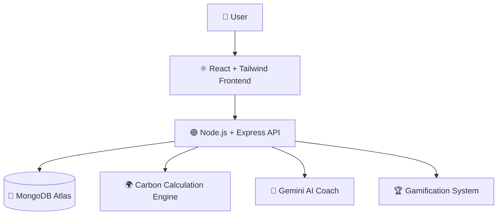
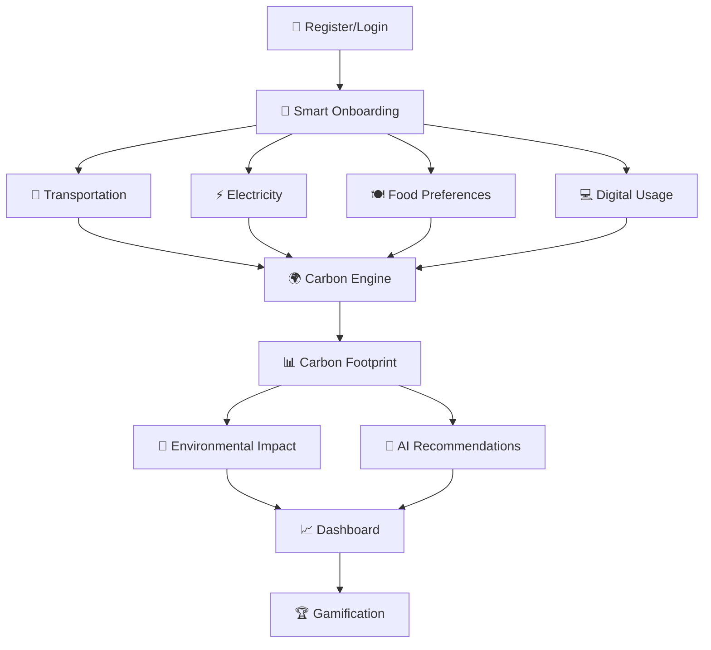

# 🌱 EcoWise AI
### Carbon Footprint Awareness Platform

> Empowering individuals to understand, track, and reduce their carbon footprint through personalized insights, AI recommendations, and sustainability-driven actions.

---

# 🏆 Hackathon Challenge

**Hack2Skill Prompt Wars – Challenge 3**

### Problem Statement
Design a solution that helps individuals understand, track, and reduce their carbon footprint through simple actions and personalized insights.

---

# 🎯 Chosen Vertical

**Sustainability & Climate Awareness**

EcoWise AI helps users:

- Understand their environmental impact
- Track emissions from daily activities
- Receive personalized sustainability insights
- Simulate eco-friendly lifestyle changes
- Stay motivated through gamification

---

# 🚀 Project Overview

Climate change is one of the biggest global challenges. However, most individuals do not understand how their everyday activities contribute to carbon emissions.

EcoWise AI bridges this gap by transforming complex sustainability data into simple, actionable insights.

The platform calculates carbon emissions based on user lifestyle patterns and provides intelligent recommendations to help users make environmentally conscious decisions.

---

# ✨ Key Features

## 🔐 Authentication
- JWT Authentication
- Secure Password Hashing
- Protected Routes
- Session Persistence
- Role-based route protection
- Secure environment configuration

### Testing & Quality
- Jest
- Validation Middleware
- Error Handling Middleware
- Accessibility Practices

---

## 👋 Smart Onboarding
Collects user information including:

- City
- Transportation Habits
- Daily Travel Distance
- Electricity Consumption
- Food Preferences
- Digital Device Usage
- Work Style
- Sustainability Goals

### Additional Features
- Multi-step wizard
- Auto-save progress
- Progress restoration
- Prevent data loss
- Real-time form validation
- Accessible form controls and error handling
- Keyboard-friendly navigation

---

## 🌍 Carbon Footprint Engine

Calculates emissions from:

### 🚗 Transportation
- Car
- Bike
- Bus
- Metro
- Walking
- Remote Work

### ⚡ Electricity Usage
Monthly electricity consumption analysis.

### 🍽 Food Habits
Different dietary patterns and their environmental impact.

### 💻 Digital Activities
Daily screen time and digital device usage.

Provides:

- Total Carbon Footprint
- Category-wise Emissions
- Carbon Score
- Equivalent Trees Required
- Environmental Impact Insights

---

## 🤖 AI Sustainability Coach

Provides:

- Personalized recommendations
- Emission explanations
- Sustainability guidance
- Eco challenges
- Future predictions

---

## 🎮 Gamification

Users earn:

- Green Points
- Levels
- Badges
- Achievements
- Sustainability Milestones

---

## ♿ Accessibility & User Experience

EcoWise AI is designed with inclusivity and usability in mind.

### Accessibility Features
- Semantic HTML landmarks (`header`, `main`, `nav`)
- Accessible form labels and validation messages
- ARIA attributes for interactive components
- Screen-reader friendly loading states
- Keyboard-accessible navigation and controls
- Focus indicators for buttons and form elements
- Responsive design across desktop and mobile devices

---
# 📊 Analytics & Forecasting

EcoWise AI provides actionable sustainability analytics.

### Features
- Category-wise emission analysis
- Historical carbon tracking
- Weekly progress monitoring
- Carbon score generation
- Tree-equivalent calculations
- Trend visualization
- Linear regression-based future projections
- Goal-oriented sustainability forecasting
---

  
# ⚡ Performance Optimizations

EcoWise AI is optimized for performance and scalability.

### Backend Optimizations
- Parallel database operations using Promise.all()
- Lean MongoDB queries using `.lean()`
- Database indexing for frequently queried fields
- Connection reuse and lazy database initialization
- Reduced unnecessary document hydration
- Optimized query selection using `.select()`
- Reusable helper utilities
- Efficient projection algorithms

### Frontend Optimizations
- Vite-powered lightning-fast builds
- Context-based state management
- Reduced unnecessary component re-renders
- API abstraction layer
- Optimized loading states
- Responsive image and component rendering
- Efficient route handling
---
 # 🚀 Production Readiness

EcoWise AI is designed with production readiness in mind.

### Production Features
- Environment-based configuration
- Secure secrets management
- Optimized build pipeline
- Error recovery mechanisms
- Scalable MongoDB Atlas integration
- Cloud deployment compatibility
- Health monitoring endpoint
- Maintainable project architecture

---
# 📈 Non-Functional Requirements

### Scalability
- Modular architecture
- Reusable services
- Database indexing
- Optimized queries

### Maintainability
- Separation of concerns
- Feature-based structure
- Reusable utilities
- Consistent naming conventions

### Reliability
- Centralized error handling
- Database connection management
- Input validation
- Defensive programming practices

### Performance
- Lean database queries
- Parallel operations
- Efficient rendering
- Optimized state updates

# 🔮 Future Scope

- Real-time carbon tracking integrations
- Household and family sustainability groups
- Community challenges and leaderboards
- Regional carbon benchmarking improvements
- Advanced AI sustainability planning
- Renewable energy recommendation engine
- Carbon offset marketplace integrations

---

# 🧠 Approach & Logic

EcoWise AI follows a user-centric approach:

### Step 1
Authenticate user securely.

↓

### Step 2
Collect lifestyle information through onboarding.

↓

### Step 3
Generate personalized carbon profile.

↓

### Step 4
Calculate emissions using Carbon Engine.

↓

### Step 5
Create sustainability persona.

↓

### Step 6
Provide AI-driven recommendations.

↓

### Step 7
Reward users for sustainable actions.

# 🧪 Engineering Quality

### Backend Engineering
- Service-oriented architecture
- Modular feature organization
- Reusable utility functions
- Centralized validation logic
- Consistent error handling
- Database abstraction patterns
- Maintainable code structure

### Frontend Engineering
- Component-driven architecture
- Reusable hooks and contexts
- API service abstraction
- Clean state management
- Scalable routing structure
- Separation of concerns
---

# 🏗 System Architecture

# 🔄 Application Flow

